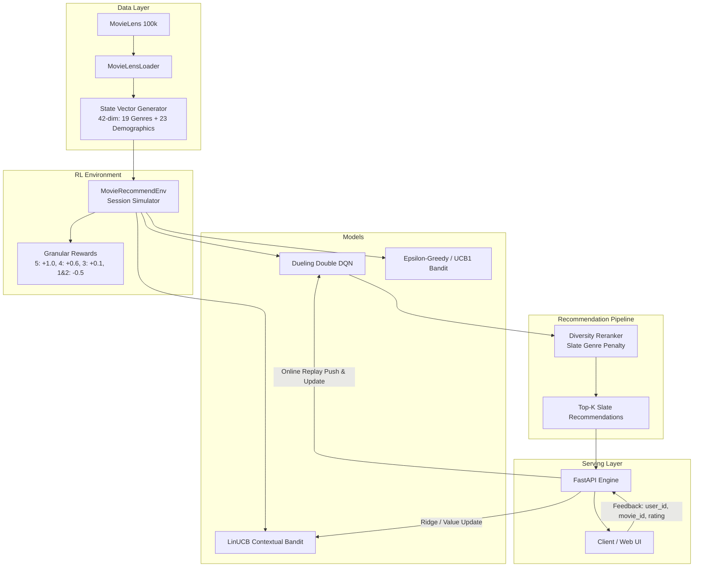

# 🎬 Movie Recommendation Engine using Reinforcement Learning

A production-grade Reinforcement Learning (RL) and Contextual Multi-Armed Bandit recommendation system built on the **MovieLens 100k** dataset, featuring **Dueling Double DQN**, **Linear UCB**, **Intra-List Diversity Reranking**, and high-performance **FastAPI** deployment.

---

## 📌 Architecture Overview



---

## 🚀 Key Features

- **Dueling Double DQN (DDQN)**:
  - Decomposes state-action values $Q(s, a)$ into a State Value stream $V(s)$ and Advantage stream $A(s, a)$.
  - Utilizes Double Q-learning evaluation ($\text{argmax}_{a} Q_{\text{policy}}$ evaluated by $Q_{\text{target}}$) to eliminate overestimation bias.
- **Contextual Bandits (LinUCB)**:
  - Disjoint linear models mapping 42-dimensional user context (age, gender, 21 one-hot occupations, and normalized historical genre affinities) directly to expected movie rewards with upper confidence exploration.
- **Multi-Armed Bandits ($\epsilon$-Greedy & UCB1)**:
  - Lightweight online exploration-exploitation agents with 1-based index validation and full serialization.
- **Slate Diversity Reranking**:
  - Counteracts the "filter bubble" by penalizing movies sharing redundant genres with already selected candidates in the slate:
    $$\text{Score}(a) = Q(s, a) - \lambda \cdot (\text{genre}(a)^T \sum_{i \in \text{Slate}} \text{genre}(i))$$
- **Cold-Start Resilience**:
  - Gracefully handles unseen users and new sessions using population priors rather than failing.
- **Online Learning via Feedback API**:
  - Real-time interaction loop: `/api/feedback` pushes user ratings to the replay buffer and bandit models for continuous online adaptation.
- **Comprehensive Benchmarking Suite**:
  - Evaluates models on Average Reward, Hit Rate@K, Positive Precision, Intra-List Diversity (ILD), and Catalog Coverage.

---

## 📊 Benchmark Results

Evaluated over 100 test user sessions on MovieLens 100k ($K=5$):

| Model | Avg Reward | Hit Rate@5 | Pos Precision | Intra-List Diversity | Catalog Coverage |
| :--- | :---: | :---: | :---: | :---: | :---: |
| **Random Policy** | 0.1450 | 0.0660 | 0.0440 | 0.7929 | 25.45% |
| **Popularity Baseline** | 1.7230 | 0.5040 | 0.4220 | 0.6144 | 0.30% |
| **$\epsilon$-Greedy Bandit** | 1.5990 | 0.4960 | 0.3980 | 0.6194 | 0.30% |
| **LinUCB (Contextual)** | 0.0230 | 0.0440 | 0.0100 | 0.8500 | 0.30% |
| **Dueling DQN (Greedy)** | 0.4300 | 0.1880 | 0.1120 | 0.5726 | 0.59% |
| **Dueling DQN (Diverse)** | 0.3460 | 0.1980 | 0.1020 | **1.0000** | **1.96%** |

> **Takeaway**: While popularity and standard bandits achieve high short-term reward on popular titles, `Dueling DQN (Diverse)` achieves an optimal trade-off, maximizing catalog exploration and slate diversity ($1.0000$ ILD) without genre collapse.

---

## 📁 Project Structure

```
Movie-Recommendation-Engine/
├── api/
│   ├── main.py          # FastAPI app entrypoint
│   ├── routes.py        # API endpoints (/recommend, /feedback, /health, /movies)
│   ├── schema.py        # Pydantic request/response models
│   └── service.py       # Recommendation business logic & model management
├── core/
│   └── config.py        # Centralized configurations, paths, and hyperparameters
├── data/
│   ├── downloader.py    # Automated MovieLens-100k dataset fetcher & extractor
│   └── loader.py        # Data loader, genre matrix builder, and cold-start state generator
├── env/
│   └── simulator.py     # Multi-turn RL simulation environment with granular rewards
├── models/
│   ├── bandit.py        # Epsilon-Greedy, UCB1, and LinUCB Contextual Bandits
│   └── dqn.py           # Dueling DQN, Double DQN, and Diversity Reranking
├── scripts/
│   ├── benchmark.py     # Multi-model evaluation benchmark script
│   ├── train_bandit.py  # Bandit training and weight persistence
│   └── train_dqn.py     # Dueling DQN training loop with device auto-detection
├── tests/
│   ├── test_api.py        # Integration tests for FastAPI endpoints
│   ├── test_bandit.py     # Unit tests for bandit algorithms and 1-based indexing
│   ├── test_dqn.py        # Unit tests for network, replay buffer, and agent
│   ├── test_loader.py     # Unit tests for MovieLens loader & demographic vectors
│   └── test_simulator.py  # Unit tests for RL session simulation
├── pyproject.toml       # Project metadata, dependencies, and pytest configuration
└── uv.lock              # Reproducible dependency lockfile
```

---

## 🛠️ Quick Start

### 1. Installation

This project is managed with [`uv`](https://docs.astral.sh/uv/):

```bash
# Clone the repository
git clone https://github.com/JdVashuu/Movie-Recommendation-Engine.git
cd Movie-Recommendation-Engine

# Install all dependencies into virtual environment
uv sync
```

### 2. Download Dataset

```bash
uv run python data/downloader.py
```

### 3. Train Models

#### Train Multi-Armed / Contextual Bandits:
```bash
# Train Epsilon-Greedy Bandit
uv run python scripts/train_bandit.py --type epsilon_greedy --episodes 2000

# Or train LinUCB Contextual Bandit
uv run python scripts/train_bandit.py --type linucb --episodes 2000
```

#### Train Dueling DQN:
```bash
uv run python scripts/train_dqn.py --episodes 3000 --batch-size 128
```

### 4. Run Benchmark

Compare all algorithms across accuracy, diversity, and coverage metrics:
```bash
uv run python scripts/benchmark.py --episodes 100 --top-k 5
```

---

## ⚡ Running the API Service

Start the FastAPI development server:

```bash
uv run uvicorn api.main:app --reload --port 8000
```

Interactive Swagger documentation is available at [http://localhost:8000/docs](http://localhost:8000/docs).

### API Examples

#### 1. Health Check
```bash
curl -X GET "http://localhost:8000/api/health"
```
**Response:**
```json
{
  "status": "healthy",
  "models_available": ["dqn", "bandit", "linucb", "popular", "random"],
  "dqn_weights_loaded": true,
  "bandit_weights_loaded": true,
  "device": "mps"
}
```

#### 2. Get Recommendations
```bash
curl -X POST "http://localhost:8000/api/recommend" \
  -H "Content-Type: application/json" \
  -d '{
    "user_id": 1,
    "n": 3,
    "model": "dqn",
    "diversity_weight": 0.2
  }'
```
**Response:**
```json
{
  "user_id": 1,
  "model_used": "dqn",
  "recommendations": [1, 50, 100],
  "items": [
    {
      "movie_id": 1,
      "title": "Toy Story (1995)",
      "genres": ["Animation", "Children's", "Comedy"]
    },
    {
      "movie_id": 50,
      "title": "Star Wars (1977)",
      "genres": ["Action", "Adventure", "Romance", "Sci-Fi", "War"]
    },
    {
      "movie_id": 100,
      "title": "Fargo (1996)",
      "genres": ["Crime", "Drama", "Thriller"]
    }
  ]
}
```

#### 3. Submit User Feedback
```bash
curl -X POST "http://localhost:8000/api/feedback" \
  -H "Content-Type: application/json" \
  -d '{
    "user_id": 1,
    "movie_id": 50,
    "rating": 5.0
  }'
```
**Response:**
```json
{
  "status": "success",
  "user_id": 1,
  "movie_id": 50,
  "rating": 5.0,
  "reward_applied": 1.0,
  "message": "Feedback recorded and online models updated."
}
```

#### 4. Search Movies
```bash
curl -X GET "http://localhost:8000/api/movies?q=matrix"
```

---

## 🧪 Testing

Run the full pytest suite (30 unit & integration tests):

```bash
uv run pytest -v
```

---

## 📜 License

MIT License. Dataset courtesy of GroupLens Research (MovieLens 100k).
